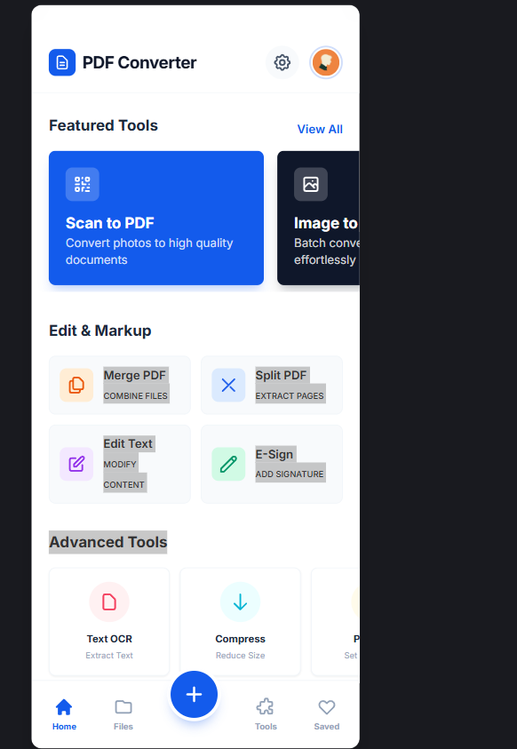

# PDF Converter App — Implementation Todo List

**Platform:** Android (Kotlin + Jetpack Compose)
**Architecture:** MVI (Model-View-Intent)
**Min SDK:** API 28 (Android 9.0)
**Processing:** Fully on-device / offline
**Cloud:** Optional Google Drive sync
**OCR:** ML Kit (on-device)

---

## Legend
- [x] Done
- [ ] Not started yet
- [~] Partially done / in progress

---

## Phase 1 — Project Skeleton & Core Infrastructure

### Root Project Config
- [x] `settings.gradle.kts` — module includes (app + 5 core + 8 feature modules)
- [x] `build.gradle.kts` — top-level plugin declarations
- [x] `gradle/libs.versions.toml` — version catalog (all libraries + plugins)
- [x] `gradle.properties` — JVM args, parallel build, config cache flags
- [x] `gradle/wrapper/gradle-wrapper.properties` — Gradle 8.6
- [x] `gradlew.bat` — Windows Gradle wrapper script

### App Module
- [x] `app/build.gradle.kts` — app config (minSdk 28, targetSdk 34, Compose, Hilt, ProGuard)
- [x] `app/src/main/AndroidManifest.xml` — permissions, activities, WorkManager override
- [x] `app/proguard-rules.pro` — keep rules for PdfBox, ML Kit, ZXing, Room, Hilt
- [x] `app/src/main/res/values/strings.xml` — all string resources for all 8 modules
- [x] `app/src/main/res/values/themes.xml` — base Android theme

### App Source Files
- [x] `PdfConverterApp.kt` — Application class, Hilt + WorkManager + Timber setup
- [x] `MainActivity.kt` — entry point, edge-to-edge, Compose host
- [x] `navigation/Screen.kt` — sealed class with all named routes
- [x] `navigation/AppNavGraph.kt` — NavHost with all composable destinations
- [x] `ui/HomeScreen.kt` — dashboard grid with 8 module cards

### Core Module Build Files & Manifests
- [x] `core/common/build.gradle.kts`
- [x] `core/ui/build.gradle.kts`
- [x] `core/data/build.gradle.kts`
- [x] `core/domain/build.gradle.kts`
- [x] `core/filesystem/build.gradle.kts`
- [x] AndroidManifest.xml for each core module (all empty stubs)

### Core:common — MVI Base & Utilities
- [x] `mvi/MviContract.kt` — `MviState`, `MviIntent`, `MviSideEffect` marker interfaces
- [x] `mvi/MviViewModel.kt` — base ViewModel with `updateState()`, `sendEffect()`, `onIntent()`
- [x] `result/PdfResult.kt` — `Success / Error / Loading` sealed class + `runCatchingPdf {}`
- [x] `extensions/ContextExtensions.kt` — URI helpers, toast, copyUriToTempFile

### Core:ui — Theme & Shared Components
- [x] `theme/Color.kt` — brand palette (light + dark)
- [x] `theme/Type.kt` — Material 3 typography scale
- [x] `theme/Theme.kt` — `PdfConverterTheme` with dynamic color support
- [x] `components/PdfConverterComponents.kt` — `PdfTopBar`, `PdfLoadingOverlay`, `PdfProgressScreen`, `PdfErrorState`, `PdfEmptyState`, `PermissionRationaleCard`

### Core:domain — Domain Models
- [x] `model/PdfDocument.kt`
- [x] `model/RecentFile.kt`
- [x] `model/Folder.kt`

### Core:data — Database & Repositories
- [x] `database/entity/PdfDocumentEntity.kt` — Room entity
- [x] `database/entity/RecentFileEntity.kt` — Room entity with FK to PdfDocument
- [x] `database/entity/FolderEntity.kt` — Room entity
- [x] `database/dao/PdfDocumentDao.kt` — CRUD + search + Flow queries
- [x] `database/dao/RecentFileDao.kt` — recent files with auto-prune
- [x] `database/dao/FolderDao.kt` — folder CRUD
- [x] `repository/PdfDocumentRepository.kt` — domain↔entity mapping + business logic
- [x] `database/AppDatabase.kt` — Room database class
- [x] `di/DataModule.kt` — Hilt module providing DB + repositories

### Core:filesystem — File I/O Utilities
- [x] `FileManager.kt` — internal storage helpers, temp dir management
- [x] `SafHelper.kt` — Storage Access Framework wrappers
- [x] `di/FilesystemModule.kt` — Hilt module

---

## Phase 2 — Feature: Scanner Module

### Build & Config
- [x] `feature/scanner/build.gradle.kts`
- [x] `feature/scanner/src/main/AndroidManifest.xml`

### MVI Contract
- [x] `contract/ScannerContract.kt` — `ScannerState`, `ScannerIntent`, `ScannerSideEffect`

### Processing Engine
- [x] `processing/EdgeDetector.kt` — OpenCV `findContours` + `approxPolyDP` quad detection
- [x] `processing/PerspectiveCorrector.kt` — `getPerspectiveTransform` + `warpPerspective`
- [x] `processing/ImageEnhancer.kt` — filter pipeline (Original / Enhanced / B&W / Grayscale)
- [x] `processing/ScanToPdfExporter.kt` — combine processed bitmaps → PDF via PdfBox

### ViewModel
- [x] `viewmodel/ScannerViewModel.kt`

### UI Screens
- [x] `ui/CameraScreen.kt` — CameraX preview, capture, flash toggle, grid overlay
- [x] `ui/CropScreen.kt` — draggable corner handles, perspective correction preview
- [ ] `ui/PageReviewScreen.kt` — multi-page grid, drag-drop reorder, delete, filter selector

---

## Phase 3 — Feature: Converter Module

### Build & Config
- [x] `feature/converter/build.gradle.kts`
- [x] `feature/converter/src/main/AndroidManifest.xml`

### MVI Contract
- [x] `contract/ConverterContract.kt`

### Engine
- [x] `engine/PdfCreator.kt` — image → PDF via PdfBox
- [ ] `engine/OfficeReader.kt` — Apache POI .docx/.xlsx/.pptx → Bitmap pages
- [x] `engine/PdfMerger.kt` — merge multiple PDFs
- [x] `engine/PdfSplitter.kt` — split by page range / extract pages
- [ ] `engine/PdfToImageExporter.kt` — `PdfRenderer` → Bitmap → PNG/JPG

### ViewModel
- [x] `viewmodel/ConverterViewModel.kt`

### UI Screens
- [x] `ui/ConverterScreen.kt` — menu screen listing conversion options
- [x] `ui/ImageToPdfScreen.kt` — image picker, order, page size, progress
- [ ] `ui/OfficeToPdfScreen.kt` — file picker, conversion, progress
- [ ] `ui/MergePdfScreen.kt`
- [ ] `ui/SplitPdfScreen.kt`

---

## Phase 4 — Feature: Editor Module

### Build & Config
- [x] `feature/editor/build.gradle.kts`
- [x] `feature/editor/src/main/AndroidManifest.xml`

### MVI Contract
- [x] `contract/EditorContract.kt`

### Engine
- [x] `engine/PdfRenderer.kt` — render pages to Bitmap with zoom
- [ ] `engine/PdfTextEditor.kt` — extract text positions, write modified text back
- [ ] `engine/AnnotationManager.kt` — add/remove/serialize PDF annotations (highlight, freehand, notes)
- [ ] `engine/PageManager.kt` — reorder, delete, rotate, duplicate pages
- [x] `engine/UndoRedoStack.kt` — command pattern for all edits

### ViewModel
- [x] `viewmodel/EditorViewModel.kt`

### UI Screens
- [x] `ui/EditorScreen.kt` — PDF viewer with toolbar (edit / highlight / annotate / pages)
- [ ] `ui/AnnotationOverlay.kt` — Compose Canvas drawing layer
- [ ] `ui/PageManagementScreen.kt` — drag-drop page grid

---

## Phase 5 — Feature: Optimization Module

### Build & Config
- [x] `feature/optimization/build.gradle.kts`
- [x] `feature/optimization/src/main/AndroidManifest.xml`

### MVI Contract
- [x] `contract/OptimizationContract.kt`

### Engine
- [x] `engine/PdfCompressor.kt` — JPEG quality re-encoding, object flattening, metadata strip
- [x] `engine/ImageResizer.kt` — downscale to target DPI (72 / 150 / 300)
- [x] `engine/FileSizeOptimizer.kt` — binary-search quality to meet user max size target

### ViewModel
- [x] `viewmodel/OptimizationViewModel.kt`

### UI Screens
- [x] `ui/OptimizationScreen.kt` — DPI selector, quality slider, before/after size preview, batch queue

---

## Phase 6 — Feature: Security Module

### Build & Config
- [x] `feature/security/build.gradle.kts`
- [x] `feature/security/src/main/AndroidManifest.xml`

### MVI Contract
- [x] `contract/SecurityContract.kt`

### Engine
- [x] `engine/PdfEncryptor.kt` — AES-256 password protect / decrypt
- [x] `engine/WatermarkApplier.kt` — text/image watermark, opacity, rotation, position
- [ ] `engine/PdfSignatureManager.kt` — self-signed cert creation, PKCS#7 signing, verify
- [x] `engine/RedactionTool.kt` — permanently flatten (remove underlying text) redacted areas

### ViewModel
- [x] `viewmodel/SecurityViewModel.kt`

### UI Screens
- [x] `ui/SecurityScreen.kt` — hub screen with password / watermark / redact tabs
- [ ] `ui/PasswordScreen.kt` — set / remove password dialogs
- [ ] `ui/WatermarkScreen.kt` — watermark config UI
- [ ] `ui/RedactionScreen.kt` — draw redaction rectangles on PDF viewer

---

## Phase 7 — Feature: Smart Tools Module

### Build & Config
- [x] `feature/smarttools/build.gradle.kts`
- [x] `feature/smarttools/src/main/AndroidManifest.xml`

### MVI Contract
- [x] `contract/SmartToolsContract.kt`

### Engine
- [x] `engine/OcrProcessor.kt` — ML Kit TextRecognition on Bitmap pages → searchable PDF layer
- [x] `engine/QrEngine.kt` — ML Kit barcode scan + ZXing generation

### ViewModel
- [x] `viewmodel/SmartToolsViewModel.kt`

### UI Screens
- [x] `ui/SmartToolsScreen.kt` — combined hub: OCR, QR Scan, QR Generator, PDF Search tabs
- [ ] `ui/OcrScreen.kt` — batch OCR progress, language pack selector
- [ ] `ui/QrScannerScreen.kt` — CameraX live preview, decode result
- [ ] `ui/QrGeneratorScreen.kt` — text input → QR image → embed / export
- [ ] `ui/PdfSearchScreen.kt` — search bar, highlighted results, page navigation

---

## Phase 8 — Feature: Storage Module

### Build & Config
- [x] `feature/storage/build.gradle.kts`
- [x] `feature/storage/src/main/AndroidManifest.xml`

### MVI Contract
- [x] `contract/StorageContract.kt`

### Data Layer
- [ ] `data/FileRepository.kt` — local file CRUD + folder management
- [ ] `cloud/GoogleDriveManager.kt` — OAuth2, upload/download, conflict resolution

### ViewModel
- [x] `viewmodel/StorageViewModel.kt`

### UI Screens
- [x] `ui/StorageScreen.kt` — file list (grid/list toggle), sort, folder nav, inline folder management
- [ ] `ui/FolderScreen.kt` — create/rename/delete folders (inline in StorageScreen)
- [ ] `ui/TrashScreen.kt` — soft-delete with 30-day retention

---

## Phase 9 — Feature: Utility Module

### Build & Config
- [x] `feature/utility/build.gradle.kts`
- [x] `feature/utility/src/main/AndroidManifest.xml`

### MVI Contract
- [x] `contract/UtilityContract.kt`

### Engine
- [x] `engine/StampPlacer.kt` — predefined + custom stamp annotations on PDF
- [x] `engine/FormBuilder.kt` — fillable fields (text, checkbox, radio, dropdown) via PdfBox
- [x] `sync/OfflineSyncWorker.kt` — WorkManager worker for Drive↔local sync

### ViewModel
- [x] `viewmodel/UtilityViewModel.kt`

### UI Screens
- [x] `ui/UtilityScreen.kt` — combined hub: Stamp tab + Form tab
- [ ] `ui/StampScreen.kt` — stamp type picker + PDF placement overlay
- [ ] `ui/FormScreen.kt` — form creation canvas + field palette

---

## Phase 10 — Polish & Release

- [x] `ui/OnboardingScreen.kt` — first-launch walkthrough (4 slides, SharedPrefs flag)
- [x] `ui/SettingsScreen.kt` — save location, theme toggle, language, scan DPI, JPEG quality
- [x] `GlobalErrorHandler.kt` — uncaught exception handler, crash log files, app restart
- [x] `service/PdfProcessingService.kt` — ForegroundService with NotificationChannel progress
- [x] `service/PdfProcessingService` registered in AndroidManifest (foregroundServiceType=dataSync)
- [x] `FOREGROUND_SERVICE_DATA_SYNC` permission added to AndroidManifest
- [x] `app/build.gradle.kts` release signing config — env-var keystore, AAB minify+shrink
- [ ] Performance profiling — lazy loading large PDFs (100+ pages), bitmap memory management
- [ ] Final ProGuard/R8 tuning — verify no runtime crashes from minification
- [ ] App icon & splash screen assets

---

## Testing Checklist

- [ ] Unit tests — `PdfCompressor`, `EdgeDetector`, `OcrProcessor`, `MviViewModel` base
- [ ] MVI tests — Turbine Flow assertions for each ViewModel
- [ ] Compose UI tests — scan→crop→save, open→edit→save, image→PDF flows
- [ ] Integration test — scan → OCR → compress → password → share end-to-end
- [ ] Manual device testing — API 28, 30, 34; 100+ page PDF; offline mode
- [ ] Lint — zero warnings policy

---

## Progress Summary

| Phase | Status | Files Created |
|---|---|---|
| Phase 1 — Core Infrastructure | ✅ Complete | 36 / 36 files |
| Phase 2 — Scanner | 🟡 Core Done | 9 / 10 files |
| Phase 3 — Converter | 🟡 Core Done | 7 / 10 files |
| Phase 4 — Editor | 🟡 Core Done | 5 / 10 files |
| Phase 5 — Optimization | ✅ Complete | 8 / 8 files |
| Phase 6 — Security | ✅ Core Done | 7 / 9 files |
| Phase 7 — Smart Tools | ✅ Complete | 7 / 7 files |
| Phase 8 — Storage | ✅ Core Done | 5 / 7 files |
| Phase 9 — Utility | ✅ Complete | 7 / 7 files |
| Phase 10 — Polish & Release | 🟡 Core Done | 7 / 10 files |
| **Total** | | **~98 / 114 files** |

---

*Last updated: Phase 10 core complete — Onboarding, Settings, ForegroundService, GlobalErrorHandler, release signing done. Remaining: ProGuard tuning, app icon/splash assets, perf profiling.*
